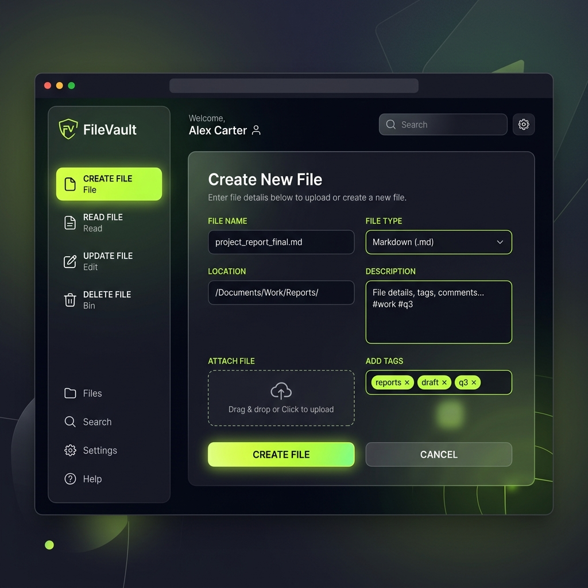

# FileVault — Interactive File Manager 📁

FileVault is a modern, high-fidelity file handling solution containing a rich glassmorphic **Web User Interface** for in-memory session management, alongside a robust **Python Command-Line Interface** (CLI) for managing files directly on the local filesystem.



## 🌟 Key Features

### 💻 Web Interface (`index.html`)
- **Rich Dashboard:** Cyberpunk-inspired dark theme using harmonized CSS styling, glassmorphism, and smooth micro-animations.
- **Full CRUD operations:** Fully functional tabs to **Create**, **Read**, **Update** (Rename, Append, Overwrite), and **Delete** files.
- **In-Memory File System:** Stores and manages files dynamically during the active session.
- **Dynamic Stats & Feedback:** Shows real-time file counts in the session footer and delivers toast notifications for action confirmations and validation feedback.

### 🐍 CLI Program (`main.py`)
- **Direct Filesystem Actions:** Read, write, append, overwrite, rename, and delete text files directly on your drive.
- **Safe Directory Scoping:** Automatically scopes all file creations to the program's root directory (`BASE_DIR`) to prevent unintended alterations elsewhere on your system.
- **Input Validation:** Gracefully handles invalid numeric entries and missing file names without crashing.

---

## 🛠️ Technology Stack

- **Frontend:** HTML5, Vanilla CSS3 (Custom Variables, Flexbox, Gradients), JavaScript ES6 (DOM, Event Listeners).
- **Backend/Scripting:** Python 3 (using `pathlib` for modern, platform-independent path resolution).

---

## 🚀 Getting Started

### Running the Web Interface
1. Simply double-click `index.html` to open the web interface in any modern browser (Chrome, Edge, Safari, Firefox).
2. Use the sidebar to switch between panels and create, view, edit, or delete files stored in your browser session.

### Running the Python CLI Program
Ensure you have Python 3 installed. Run the program from your terminal:

```bash
python main.py
```

Follow the prompts:
- **Press 1:** Create a file and write initial content.
- **Press 2:** Read a file's contents.
- **Press 3:** Update a file (Rename, Append content, or Overwrite content).
- **Press 4:** Delete a file.

---

## ⚙️ Development & IDE Setup
If you are developing this project using **VS Code**, the project comes with pre-configured settings inside the `.vscode/` directory:
- **Debugging HTML:** Configurations are included to launch the front-end directly via Edge or Chrome.
- **Debugging Python:** Debugger profiles are ready for running and stepping through `main.py` directly inside the integrated terminal.

---

## 📄 License
This project is licensed under the MIT License - see the [LICENSE](LICENSE) file for details.
